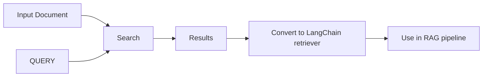

# RAG From Scratch: Indexing — Detailed Notes

This document explains the contents of
`Indexing_rag_from_scratch_12_to_14.ipynb`. The notebook focuses on advanced
indexing strategies, including multi-representation (parent/child) indexes,
RAPTOR, and use of ColBERT via RAGatouille. Diagrams are included to clarify
flows where helpful.

---

## 1. Scope of the Notebook

Unlike earlier notebooks in the series, which concentrated on simple
end-to-end RAG pipelines, this one digs into sophisticated indexing patterns
that help manage large or complex document corpora. The main parts are:

1. **Multi-representation indexing** (parent/child or summary-based retrieval).
2. **RAPTOR** (Retrieval-Augmented Prompting with Text‑Only Reranking).
3. **ColBERT via RAGatouille** (token-level vector representations for fine-
grained retrieval).

The code is largely demonstration-style, using web documents and YouTube
transcripts as sample data.

---

## 2. Environment Setup

The beginning cells install packages required for specialized loaders
(`youtube-transcript-api`, `pytube`), the `ragatouille` library for ColBERT,
and the usual LangChain dependencies. LangSmith tracing is enabled as usual.

---

## 3. Part 12: Multi-representation Indexing

This section implements a *parent/child* or *summary* index where each
"parent" document (the full article) is linked to a shorter "child"
summaries vector. The retrieval flow goes through the short summaries first to
locate candidates, then fetches the original content from a byte store.

### Workflow

1. **Load documents** from two blog posts and combine them.
2. **Summarize** each document using a chat chain (Ollama LLM) and store
   summaries in memory.
3. **Setup embedding model and Chroma vectorstore** to index these summaries.
4. **Create an `InMemoryByteStore`** to hold the full documents keyed by
   generated UUIDs.
5. **Instantiate a `MultiVectorRetriever`** that connects the vectorstore and
   byte store via a shared `id_key`.
6. **Add summaries to the vectorstore** and full docs to the byte store.
7. **Test retrieval**: first retrieve the summary via simple similarity search,
   then use the multi-retriever to get full document chunks.

This pattern is useful when you want to reduce the embedding and storage cost
by first searching in a compact representation and only loading the full text
for the candidates that matter.

### Mermaid Diagram

```mermaid
flowchart TD
    D[Original Documents] --> S[Summarization Chain]
    S --> V[Vectorstore (summaries)]
    D --> B[ByteStore (full docs)]
    query --> R[MultiVectorRetriever]
    R -->|search summaries| V
    V -->|return ids| B
    B --> C[Full document content]
    C --> A[LLM RAG generation]
``` 

This shows the two-layer retrieval pipeline: summaries first, then full text.

Related concept: the notebook calls out the parent document retriever as a
built-in alternative.

---

## 4. Part 13: RAPTOR

RAPTOR stands for Retrieval-Augmented Prompting with Text-Only Reranking and is
covered at a high level here with links to an external notebook and paper.
The notebook itself does not show code; instead it provides resources and a
flowchart screenshot. The idea is to retrieve an initial set of documents and
then rerank them using a separate LLM-based prompt.

---

## 5. Part 14: ColBERT via RAGatouille

ColBERT is a retrieval model that embeds each token separately, allowing
finer-grained matching between query and document tokens. `ragatouille` is a
wrapper that makes it easy to use ColBERT within LangChain.

### Steps shown in the notebook

1. Install `ragatouille` and load a pretrained ColBERT model.
2. Define a helper function `get_wikipedia_page` to fetch text from Wikipedia.
3. Index the retrieved page (`Hayao_Miyazaki`) with ColBERT using the library’s
   `.index` method, splitting the document and creating an index collection.
4. Use `.search` to run a query with ColBERT and inspect results.
5. Convert the index into a LangChain retriever with
   `RAG.as_langchain_retriever(k=3)` and invoke it.

This part demonstrates how to integrate state‑of‑the‑art retrieval backends
without manual embedding or vectorstore management; the library handles token
embeddings internally.

### Mermaid Diagram



---

## 6. Reusing This Notebook

- Multi-representation indexing patterns can be adapted for any pair of
  "lightweight" + "heavy" representations such as summaries+full texts,
  sectional extracts, or multimodal embeddings.
- The RAPTOR section is a pointer—grab the external notebook when you want to
  implement reranking in your own apps.
- ColBERT usage via RAGatouille can be replicated by supplying different
  documents or using the `.from_pretrained` model ID appropriate for your
  domain.

---

## 7. Additional Resources

- Greg Kamradt video on chunking for context
- RAPTOR paper: arXiv 2401.18059
- ColBERT tutorials and the RAGatouille documentation

Keep this note around when exploring advanced indexing techniques or
experimenting with hybrid retrieval architectures.