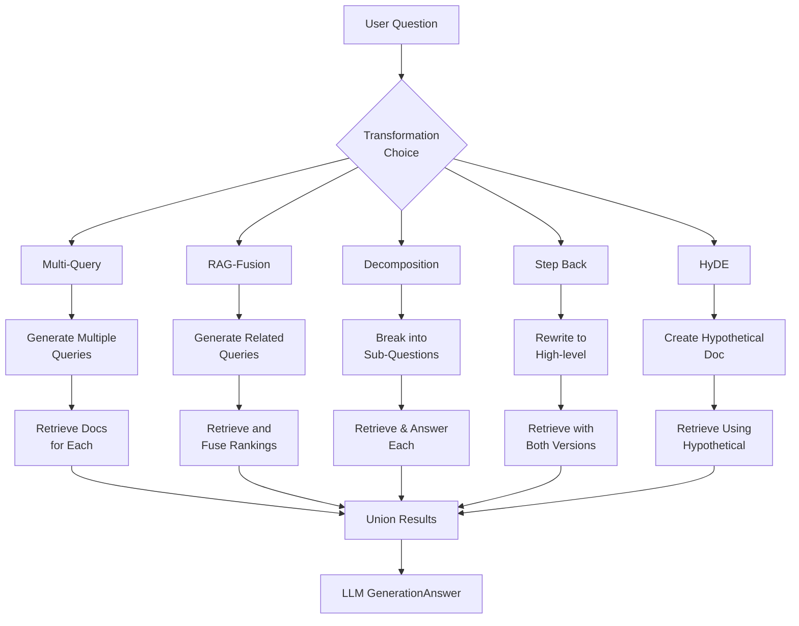

# RAG From Scratch: Query Transformations — Detailed Notes

This document provides a thorough explanation of the
`Query_Translation_rag_from_scratch_5_to_9.ipynb` notebook. Its purpose is to
help you revisit the techniques used for rewriting and manipulating the user
query as part of a retrieval-augmented generation workflow.

---

## Overview

The notebook dives into a series of query transformation strategies that can
improve retrieval performance by generating alternative question formulations,
adding hypothetical context, decomposing complex queries, and more. Each part
builds on the previous ones to showcase how modern RAG systems can adapt the
query before searching a vector store.

### Main Sections

1. **Environment Setup** – Install dependencies and configure LangSmith,
   OpenAI, or other API keys.
2. **Indexing** – A refresher on loading a sample document, splitting it, and
   building a Chroma vectorstore with Ollama embeddings. This is reused by
the various retrieval experiments.
3. **Prompt Definition** – Each transformation technique has its own prompt
   template and generation chain, usually backed by an LLM.
4. **Retrieval Chains** – Chains that combine query generation with a retriever
   (and sometimes post-processing) to yield tailored document sets.
5. **Final RAG chains** – Use the transformed query results as context for an
   LLM to produce final answers.

---

## Detailed Breakdown of Sections

### Part 5: Multi Query

This technique generates multiple paraphrased or perspective-shifted versions
of the original user question. The idea is that a distance-based semantic
search might miss relevant documents if the query phrasing differs from the
text; multiple rephrasings increase coverage.

Key components:

- **Prompt** – instructs an LLM to output five alternate questions separated
  by newlines. This prompt is wrapped in a `ChatPromptTemplate` (`prompt_perspectives`).
- **Generation chain** – runs the prompt through an `OllamaLLM` and splits the
  result into a list.
- **Retrieval** – the `generate_queries` chain is mapped over the retriever,
  producing a list of lists of documents. `get_unique_union` deduplicates them.
- **RAG** – the union of docs becomes the context for a standard RAG chain.

This section illustrates how to integrate a custom pre-processing step before
retrieval and to merge results from multiple queries.

### Part 6: RAG-Fusion

RAG-Fusion is an extension of the multi-query idea but uses reciprocal rank
fusion (RRF) to combine ranked document lists. Each generated query retrieves a
list of documents; the RRF algorithm assigns scores based on rank across lists
and reorders the union accordingly.

Highlights:

- **Query prompt** – slightly different from multi-query; only four related
  searches are generated.
- **`reciprocal_rank_fusion` function** – computes fused scores for documents
  across lists.
- **Retrieval chain** – `generate_queries` → retriever.map() → `reciprocal_rank_fusion`.
- **RAG chain** – uses the fused list as context for answer generation.

RAG-Fusion often yields higher-quality context by considering the consensus of
multiple searches.

### Part 7: Decomposition

This part focuses on breaking a complex question into several smaller sub-
questions that can be handled individually. Two styles are shown: recursive
answering (use previous answers as context) and answering sub-questions
directly.

Important elements:

- **Decomposition prompt** – instructs the model to output several sub-queries.
- **Recursive QA loop** – iterates over sub-questions, uses a RAG chain to
  answer each, and builds a growing context of Q&A pairs.
- **Individual answers** – a helper function `retrieve_and_rag` generates
  answers for each sub-question, and then another chain synthesises them into
  a final response.

This decomposition approach helps handle multi-part or highly detailed queries
by iteratively retrieving focused context.

### Part 8: Step Back

The step-back technique rewrites a question to a more generic, high-level form
that is easier to answer, retrieves context for both the original and
step-backed queries, and then formulates a response considering both sets of
context.

Key points:

- **Few-shot prompt** – provides examples of how to paraphrase into step-back
  questions.
- **Chain** – simultaneously retrieves documents using the normal question and
  the step-back question and feeds both contexts into an LLM prompt.

This can mitigate overly specific or obscure queries by adding broad
overview information.

### Part 9: HyDE

HyDE (Hypothetical Document Embeddings) generates a synthetic document that
answers the query, then uses that document for retrieval. This can be useful if
the retriever lacks good matches for the raw question; the model crafts a
pseudo-answer that the vectorstore can search against.

Elements:

- **HyDE prompt** – asks the LLM to write a paper-like passage answering the
  question.
- **Chain** – generates the hypothetical document, retrieves similar real
  documents using it, and finally uses those documents to answer the original
  question.

HyDE can recover from poor retrieval by introducing an intermediate textual
bridge.

---

## Reusing This Notebook

- When experimenting with new query transformation ideas, use the existing
  prompt templates and retrieval chains as a starting point.
- If you switch to a different LLM or vectorstore, only a few lines need
  editing (LLM instantiation and `Chroma.from_documents`).
- The notebook is structured so each technique can be executed independently;
  you can comment out prior parts when focusing on one section.

---

## Further Reading & References

- LangChain documentation on MultiQueryRetriever and RAG
- **RAG-Fusion** blog post and notebook linked in the code
- Step-back reasoning paper (arXiv 2310.06117)
- HyDE original paper (arXiv 2212.10496)

Feel free to update this document as you explore additional query
transformations or incorporate newer LangChain features.