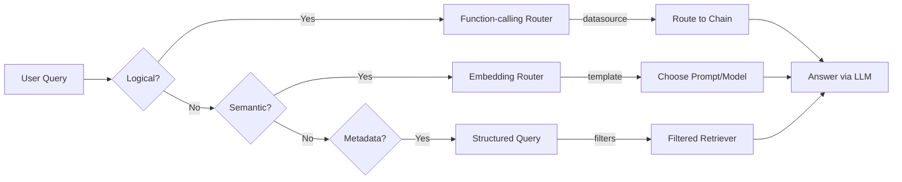

# RAG From Scratch: Routing — Detailed Notes

This document explains the `Routing_rag_from_scratch_10_and_11.ipynb` notebook
in depth. It covers the two major themes of the notebook: routing user
queries to the correct index or chain (logical/semantic routing) and
constructing structured queries for metadata filters.

---

## 1. Notebook Purpose

Routing is an important pattern in RAG applications when a single user query
could be answered by multiple specialized data sources or when you need to
perform different retrieval strategies based on the content of the question.
This notebook demonstrates:

1. **Logical routing** using function-calling and structured output to classify
   the question’s target domain (e.g. Python vs JavaScript docs).
2. **Semantic routing** using embedding-based similarity between the query and
   pre-defined prompt templates to pick an appropriate LLM persona or chain.
3. **Query structuring for metadata filters**, where a natural language question
   is parsed into a well-defined data schema that can drive filtered searches
   over a vectorstore (e.g. filtering by publish date, view count).

Each section includes runnable examples and links to the relevant LangChain
documentation.

---

## 2. Environment Setup

The first cells install essential packages and configure environment
variables. Key libraries include:

- `langchain_community` for additional loaders and utilities.
- `chrome` for the Chroma vectorstore.
- `youtube-transcript-api` and `pytube` for loading YouTube video transcripts in
  the metadata query examples.
- `langchain_ollama` for local embedding and LLM models.

LangSmith tracing is enabled to monitor the flows.

---

## 3. Part 10: Logical and Semantic Routing

### 3.1 Logical Routing (Function-calling)

Logical routing treats the problem as a simple classification task: determine
which datasource should handle the question. Modern LLMs can output structured
JSON, so we leverage the `with_structured_output` helper to define a schema for
a `RouteQuery` object.

**Key steps:**

1. Define a Pydantic model `RouteQuery` with a `datasource` field enumerating
   the allowed domains (`python_docs`, `js_docs`, `golang_docs`).
2. Create a chat LLM (`ChatOllama`) wrapped with `with_structured_output`.
3. Build a `ChatPromptTemplate` with a system message instructing the model to
   choose the appropriate datasource based on the programming language in the
   question.
4. Combine the prompt and structured LLM into a `router` chain.
5. Invoke the router with a sample query and inspect `result.datasource`.

Once you have the `datasource`, you can route to different chains using a
simple helper function (`choose_route`) wrapped in `RunnableLambda`.

### 3.2 Semantic Routing (Embedding-based)

Semantic routing uses vector similarity to choose between multiple possible
prompts or processing chains. In the notebook’s example, two LLM persona
prompts are defined (`physics_template` and `math_template`). The chosen
prompt depends on which template is most similar (by cosine similarity) to the
query embedding.

**Implementation details:**

- Embed the prompt templates using `OllamaEmbeddings`.
- Create a `prompt_router` function that embeds the incoming query, computes
  similarity with the template embeddings, and returns a `PromptTemplate` for
  the most similar template.
- Build a chain combining the query, `RunnableLambda(prompt_router)`, and an
  LLM to produce the final answer.

This pattern can generalise to routing queries to entirely different indexes or
specialized retrieval chains based on semantic closeness.

---

## 4. Part 11: Query Structuring for Metadata Filters

Many vectorstores support metadata fields on each document. This section shows
how to convert a free-form question into a structured search query that can be
used to apply similarity search together with metadata filters (e.g. video
length, publish date).

### Key concepts:

- **Metadata schema** – defined via a Pydantic model `TutorialSearch` with
  fields such as `content_search`, `title_search`, and optional numeric/date
  filters (`min_view_count`, `earliest_publish_date`, etc.).
- **Prompt design** – instruct the LLM to produce a database query consistent
  with the schema; unrecognised acronyms are left unchanged.
- **Structured output** – wrap the LLM with `TutorialSearch` to enforce the
  schema and enable easy access to fields.

### Example usage:

The notebook demonstrates several queries executed via `query_analyzer.invoke`:

- "rag from scratch"
- "videos on chat langchain published in 2023"
- "videos that are focused on the topic of chat langchain that are published
  before 2024"
- "how to use multi-modal models in an agent, only videos under 5 minutes"

Each invocation returns a populated `TutorialSearch` instance, which can be
pretty-printed or translated into a retrieval call against a vectorstore using
`self_query` or similar techniques.

The final note points to LangChain documentation for building the actual
retriever from these structured queries.

---

## 5. Diagrams and Visuals

To make the flow clearer, here's a Mermaid diagram illustrating the main
routing paths:

Each branch leads eventually to an LLM-based answer once the appropriate
context or prompt has been selected.

---

## 6. Reusing This Notebook

- **Logical routing**: add more datasources by extending the `RouteQuery`
  model and updating the prompt text. Use the `RunnableLambda` pattern to
  insert custom logic.
- **Semantic routing**: any set of specialized prompts or even chained
  retrieval paths can be chosen by embedding similarity; just replace the
  `prompt_templates` list.
- **Metadata filters**: adapt the `TutorialSearch` schema to your dataset and
  metadata fields, and plug the structured output into your retriever
  construction (e.g. via the `SelfQueryRetriever`).

---

## 7. References

- LangChain docs: [routing to multiple indexes](https://python.langchain.com/docs/use_cases/query_analysis/techniques/routing#routing-to-multiple-indexes) and [embedding router cookbook](https://python.langchain.com/docs/expression_language/cookbook/embedding_router).
- Blog posts on query construction and graph/SQL enhancements.

Use this note to refresh routing strategies or to prototype new classification
or filtering logic in your RAG systems.